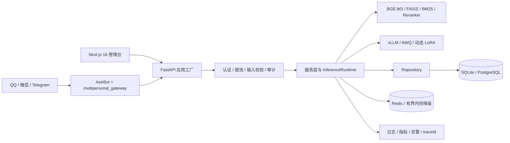

# MultiPersonal Chat System 保研项目答辩与深度问答手册

> 版本：2026-08-09，基于 `KISAKI-LLM-RESEARCH-V4`、当前代码架构与仓库证据更新。
>
> 用途：帮助项目作者准确讲清研究问题、个人贡献、技术选择、工程实现、实验进度和结论边界。手册中的“完成”“候选”“冻结”“阻塞”具有不同含义，答辩时不得混用。

## 1. 项目定位

MultiPersonal Chat System 不是单纯的聊天机器人，也不是若干 LLM 框架的拼装演示。它是一个以角色对话为研究对象、以可复现实验为核心、能够通过真实 IM 平台交付的单机 LLM 研究系统。

项目试图回答四个递进问题：

1. 如何从原作文本中构建来源可追踪、人物归属正确的角色训练数据？
2. LoRA、NEFTune、DoRA、RSLoRA 和 Sequence Packing 对角色对话质量、训练成本和稳定性分别有什么影响？
3. 如何把角色风格、外部知识、引用、拒答和运行时安全分层，而不是混在一次微调里？
4. 如何把实验模型部署成具备鉴权、限流、幂等、降级、追踪和多平台接入能力的完整系统？

主线可以概括为：

```text
原作语料 -> 来源审计 -> 人工审核 -> SFT/PEFT -> 独立验证与 Gold
         -> RAG -> AWQ/vLLM -> FastAPI -> AstrBot -> QQ/微信/Telegram
```

## 2. 最值得讲的成长故事

### 2.1 从“模型能说话”到“角色像不像”

项目最初从角色聊天出发。通用模型即使知道人物设定，也容易出现关系事实错误、语言风格漂移、过度模板化和长对话人格衰减。于是项目从原作中提取月社妃台词，建立人物画像，并尝试 LoRA 微调。

这一阶段学到的第一件事是：训练成功只代表优化过程完成，不代表人物还原成功。训练 loss、主观感觉和几条好看的样例都不能独立支持结论。

### 2.2 从“像不像”到“证据是否可信”

早期数据和实验暴露了更重要的问题：合成样本会稀释原作风格，错误拼接会把他人台词归给目标人物，多轮样本可能只监督最后一轮，评测题还可能与训练内容重叠。

项目因此进入 V4 数据重建：

- 从 1,598 条月社妃原作直接台词出发，保留文件、行号、事件 ID 和上下文来源。
- 对原作提取、构造样本、排除记录和独立验证集分别审核。
- 159 条构造样本经过初审和第二轮复核后排除 9 条，形成 150 条已批准构造数据。
- V4 当前包含 948 条训练数据：522 条经最终上下文复审的原作对话、150 条既有构造数据，以及 276 条经审核修订的 V4.1 五轮用户会话（4 条 DeepSeek round06 + 272 条 Codex 自动化批次）。
- 独立 validation 已审核并冻结 70 条。
- Gold v2.1 已批准为开发集，Gold v3 的 150 条最终盲测已审核并冻结；Game Train 上下文质量复审也已关闭。

这体现的不是“反复清洗数据”，而是一次研究方法升级：先保证数据、评测和比较协议可信，再讨论模型优化。

### 2.3 从实验脚本到可维护系统

系统侧也从路由直接调用数据库和模型，逐步重构为应用工厂、运行时容器、Protocol 接口、仓储和服务层。前端通过集中 API contract 调用后端；推理由统一 `InferenceRuntime` 管理；vLLM、RAG、数据库和 AstrBot 都有清晰的故障边界。

项目没有为个人研究原型堆 Kubernetes 或服务网格，而是把精力放在更有解释价值的地方：依赖方向、生命周期、资源上限、可观测性和真实 GPU 实验。

## 3. 三种口述版本

### 3.1 30 秒版本

“我的项目是一个面向角色对话研究的多平台 LLM 系统。我以月社妃为主要研究角色，从 1,598 条原作台词出发，完成来源审计、人工数据审核、独立验证集和 Gold 评测设计，并计划用 Qwen3-8B 对 LoRA、NEFTune、DoRA、RSLoRA 和 Packing 做受控消融。推理侧使用 AWQ 和 vLLM，知识侧实现混合 RAG、结构化引用和拒答，系统通过 FastAPI 与 AstrBot 接入 QQ、微信和 Telegram。我的重点是把数据、训练、评测、推理和工程交付组织成一条可复现证据链。”

### 3.2 2 分钟版本

“这个项目起点是角色对话，但我很快发现，模型能生成流畅文本不等于真正还原人物。早期合成数据存在模板化和角色偏移，评测也有污染风险，所以我没有继续叠训练技巧，而是回到数据基础。

我从 1,598 条原作直接台词建立可追踪语料，并重建对话边界、RAG held-out 和固定 split。现在 V4 有 948 条训练数据和 70 条独立验证数据；训练集由 522 条经上下文复审的原作样本、150 条既有构造样本和 276 条经审核晋升的五轮会话组成。Gold v2.1 已批准为开发集，Gold v3 的 150 条最终盲测已冻结；Game Train 复审最终排除 54 条并为 107 条补齐可靠上下文。

训练研究采用单变量设计：E1 是标准 LoRA，E2 只增加 NEFTune，E3 只使用 DoRA，E4 只使用 RSLoRA，E5 只改变 Packing。旧版本五组 Seed 42 已经跑过，但由于数据和评分逻辑已更新，我只把它们作为历史探索，不包装成 V4 结论。

工程上，我把后端重构为应用工厂、运行时容器、仓储和服务层，统一管理队列、同会话串行、RAG、vLLM 和持久化。AstrBot 只做平台网关，后端负责业务决策，并使用 HMAC、防重放、幂等、限流、熔断和 traceId。这个项目最想展示的是：我不只会调用模型，也能发现数据和实验中的问题，建立可信比较，并把模型能力落到可维护系统中。”

### 3.3 8 分钟结构

1. **问题，45 秒**：为什么“流畅”不等于“角色一致”。
2. **数据，90 秒**：1,598 条来源语料、948 条 canonical 训练数据、70 条独立验证数据、人工审核与泄漏审计。
3. **实验，90 秒**：R1V4 五组单变量 PEFT，旧实验为何只能做历史证据。
4. **RAG，60 秒**：参数记忆与外部证据分工、结构化引用和拒答。
5. **推理，60 秒**：BF16 训练、AWQ 部署、vLLM 动态 LoRA 与真实性能指标。
6. **架构，90 秒**：应用工厂、运行时容器、服务/仓储边界和完整消息链路。
7. **可靠与安全，45 秒**：队列、串行、幂等、HMAC、防重放、熔断和降级。
8. **结果边界，45 秒**：历史 pilot 的 `p=0.512`、V4 尚未形成正式结论。
9. **下一步，30 秒**：复验正式门禁，运行 E1-E5 seed 42 pilot，再按预注册规则补多种子。

## 4. 当前事实与结论边界

### 4.1 当前权威状态

| 项目 | 当前状态 | 答辩时如何表述 |
|---|---|---|
| 原作直接台词 | 1,598 条，来源审计通过 | 已完成可追踪提取和来源核验 |
| system prompt v3 | 已由项目负责人批准 | 可以作为当前角色策略 |
| V4 train | 当前 948 条 | 522 条经上下文复审的原作、150 条既有构造、276 条经审核晋升的五轮会话；已冻结 |
| 构造训练数据 | 150 条已批准 | 第二轮已从 159 条中排除 9 条 |
| validation | 70 条已冻结 | 与 train、RAG held-out 无事件重叠 |
| Gold v2.1 | 150 条，已批准 | 仅用于开发比较，不是正式 Gold 结论 |
| Gold v3 | 150 条 | 已审核并冻结为最终 held-out，增补后污染复审仍为 clean |
| 旧 R1 E1-E5 | Seed 42 训练和真实评测完成 | 仅作历史探索；E3 自动指标暂时最好 |
| R1V4 | 被训练门禁阻塞 | 尚未运行，不得声称某变体更优 |
| R2 | 60 条 held-out 候选待冻结 | RAG 实验设计已具备，正式结果未形成 |
| R3 | SSE TTFT 基准器已实现 | 等待隔离 vLLM 服务真实测试 |
| R4 | 等待至少 100 条人工批准偏好对 | DPO pilot 尚未开始，不称 RLHF |
| S1 | 待最终系统验收 | 多平台能力已实现，正式跨平台研究结论待验证 |

Gold v2.1 的 150 条候选包括：persona 30、factual 20、persona knowledge 10、multiturn 30、safety 30、RAG grounded 30。它目前是 `development_only`，不能与“已冻结正式盲测集”混淆。

### 4.2 历史结果应该怎么讲

旧 `prompt-v1 pilot` 中，E1 胜 26、E2 胜 32、平局 62；去除平局后的双侧精确符号检验为 `p=0.512`。正确结论是：没有足够证据说明标准 LoRA 和 LoRA + NEFTune 存在显著胜率差异。

旧 R1 E1-E5 后续都完成了 Seed 42 训练与真实评测，E3 在旧自动指标上暂时最好。但这些结果使用旧数据和旧评分逻辑，已经归档为 `legacy/non-comparable`，不能直接回答 V4 中 DoRA 是否最好。

### 4.3 不能声称的内容

- 可以说 train/validation 文件具有当前哈希，但不能说 V4 已最终封版；当前仍有 Game Train 上下文质量复审这一项阻塞。
- 不能说 DoRA、RSLoRA、NEFTune 或 Packing 已在 V4 中胜出。
- 不能把旧数据上的 E3 自动指标优势写成当前正式结论。
- 不能把单 Seed pilot 写成稳定可复现结论。
- 不能把 DPO 写成 RLHF，也不能把尚未实现的 QA-LoRA 写成能力。
- 不能把 mock、界面演示、Qwen2.5 旧报告或开发 Gold 当作真实正式实验。
- 不能说个人微信具有官方接口同等稳定性和合规性。

## 5. 系统架构



### 5.1 为什么使用应用工厂和 RuntimeContainer

`create_app()` 负责创建 FastAPI 实例、安装中间件和路由；`RuntimeContainer` 保存数据库、推理运行时和启动环境快照。这样测试可以注入替代依赖，应用实例之间不会依赖难以控制的全局状态，启动校验也不会被运行期间环境变量变化影响。

### 5.2 为什么有 Repository 和 Service

- API 层负责 HTTP 协议、认证、状态码和 Schema。
- Service 层组织与传输无关的用例，例如聊天生成和模型管理。
- Repository 通过 Protocol 定义消息和用户数据持久化接口。
- SQLite/PostgreSQL 是接口的具体实现。

这并不是为了追求层数，而是为了让业务规则可以脱离 FastAPI 和具体数据库测试。当前项目仍处于渐进式重构，部分较老路由尚未完全迁移，答辩时应说明这是“已建立方向并完成关键链路”，而不是宣称全仓库已经纯净分层。

### 5.3 一条消息的完整调用链

```text
平台事件
  -> AstrBot 标准化 platform/adapter/conversation/sender/messageId
  -> token + timestamp + nonce + HMAC signature
  -> POST /api/integrations/astrbot/messages
  -> 鉴权与防重放
  -> 输入规范化与敏感管理命令拦截
  -> platform + adapter + messageId 幂等检查
  -> 平台、会话、发送者和全局限流
  -> 会话开关
  -> 有界优先级队列 + 同会话串行
  -> Prompt policy + 可选 RAG 检索
  -> vLLM 选择模型/LoRA并生成
  -> 消息与 model_invocation 入库
  -> 集成接口返回 replyText/model/costTime/traceId
  -> AstrBot 最多发送一次回复
```

管理台直接调用 `/api/generate` 时，响应还会携带结构化 `citations/confidence/abstained`；当前 AstrBot 集成响应没有透传这三个 RAG 字段，平台侧只消费最终回复文本和追踪信息。

### 5.4 为什么 AstrBot 只做网关

QQ、微信和 Telegram 的事件格式、登录方式和发送接口不同，但 RAG、LoRA、会话开关、历史和评测逻辑相同。把 AstrBot 限定为协议适配层，可以避免在每个平台复制核心能力，也方便单独替换平台适配器。

### 5.5 为什么只有一个后端 worker

当前单机研究原型中的训练任务、进程内队列、同会话锁和部分模型状态属于进程级资源。盲目开启多个 Uvicorn worker 会造成状态割裂和重复任务。项目用单 worker + 有界异步并发保证一致性；若未来水平扩展，需要先把队列、锁、任务状态和幂等统一迁移到 Redis/PostgreSQL 等共享基础设施。

### 5.6 Readiness 与 Health 的区别

`/health` 只说明进程存活；`/ready` 检查数据库和按配置要求的模型依赖。就绪检查带 TTL、并发 single-flight、有界线程卸载和超时，避免 Kubernetes 风格的高频探针反过来压垮数据库。即使项目不部署 Kubernetes，这也是正确的故障隔离设计。

## 6. LLM 与 PEFT 原理

### 6.1 LoRA 是什么

对于原权重矩阵 `W`，LoRA 冻结 `W`，只训练低秩增量：

```text
W' = W + scaling * B * A
A ∈ R^(r × k), B ∈ R^(d × r), r << min(d, k)
```

需要会解释三个参数：

- `r` 决定低秩容量和参数量。
- `alpha` 控制更新缩放，常见 LoRA 缩放为 `alpha / r`。
- target modules 决定把可训练增量放在哪些线性层。

项目固定 `r=32`、`alpha=64` 和七个 target modules，目的是先比较方法差异，避免同时扫描大量超参数导致归因混乱。

### 6.2 为什么选择七个 target modules

`q_proj/k_proj/v_proj/o_proj` 覆盖注意力投影，`gate_proj/up_proj/down_proj` 覆盖 MLP。角色风格既涉及注意力中的上下文关系，也涉及前馈层中的表达映射。覆盖七个模块能提供较强适配能力，但会增加参数量和显存，所以必须作为所有 R1V4 变体的固定条件。

### 6.3 DoRA

DoRA 将权重的方向与幅值分解，在 LoRA 低秩方向更新之外学习 magnitude。它可能更接近全量微调的表达能力，但训练开销和部署兼容性更复杂。项目把它作为独立 E3，不与 NEFTune 或 RSLoRA 同时启用。

### 6.4 RSLoRA

标准 LoRA 常用 `alpha/r`，RSLoRA 使用与 `sqrt(r)` 相关的缩放，使 rank 增大时更新强度更稳定。它解决的是高 rank 下的缩放问题，不是另一种数据增强，因此应作为独立 E4。

### 6.5 NEFTune

NEFTune 在训练时向 embedding 加入受控噪声，期望减少对小数据的机械记忆并改善泛化。它只影响训练，不改变推理结构。项目 E2 相对 E1 的唯一变量应是 `neftune_noise_alpha=5.0`。

### 6.6 Sequence Packing

Packing 将多个短样本拼入一个序列，减少 padding，提高有效 token 吞吐。必须正确构造 attention mask、label mask 和样本边界，否则模型会把相邻独立对话当成连续上下文。Packing 首先是效率实验，质量不一定提高。

### 6.7 多轮监督为什么重要

旧训练器只监督最后一个 assistant 回复，会浪费前面回合的学习信号。新的 chat dataset 按消息角色构造标签：system/user token 置为 `-100`，每个 assistant 回复都参与 loss。这样既保持因果语言建模格式，也让多轮样本中的所有目标回答得到监督。

### 6.8 QLoRA、AWQ 和 BF16 的区别

- BF16 是训练与高精度推理数值格式。
- QLoRA 通常以 4-bit 量化基座进行参数高效训练，重点是降低训练显存。
- AWQ 是权重量化推理方案，重点是部署吞吐和显存。

不能因为都出现“4-bit”就把 QLoRA 和 AWQ 混为一谈。项目正式 SFT 基座必须是非 AWQ/GPTQ 的 Qwen3-8B；AWQ 用于部署和 R3 推理基准。

### 6.9 vLLM 为什么快

vLLM 通过 PagedAttention 提高 KV Cache 内存利用率，并使用连续批处理提升并发吞吐。项目还在客户端实现健康感知、多实例选择、动态 LoRA、重试、指数退避和熔断。必须区分：vLLM 提供推理引擎能力，项目负责业务并发、会话顺序和故障策略。

## 7. 数据治理与评测

### 7.1 为什么 V4 比增加训练轮数更重要

错误人物归属、截断台词、上下文泄漏和模板化合成数据会让模型学习错误分布。增加 epoch 只会更充分地拟合这些错误。V4 优先修数据，是因为数据上限往往决定小规模角色微调的质量上限。

### 7.2 948 条 canonical 训练数据如何组成

- 576 条 `game_extraction`：由 652 条候选人工排除 76 条后形成，并隔离 validation 与 RAG evidence。
- 150 条既有构造数据：由此前 159 条复核后排除 9 条得到，已统一批准。
- 4 条 `deepseek_user_simulation_v41_reviewed`：每条是一组完整五轮会话，共监督 20 个 assistant 轮次；保留原始生成和修订来源。
- 272 条 `codex_user_simulation_v41_reviewed`：68 个自动化批次、每批 4 个完整五轮会话，共监督 1,360 个 assistant 轮次；每批都有逐轮 review、批准文件和晋升哈希链。

构造数据没有冒充原作，并保留审核记录。canonical manifest 当前是 `frozen`，Gold v3 和 Game Train 上下文质量复审均已关闭。

### 7.3 validation 为什么最终是 70 条

当前抽取器重建出 77 条 validation 候选，人工审核最终批准 70 条并排除 7 条。冻结记录的 SFT ID 和 raw event ID 均可回溯，并与 train、RAG held-out 保持隔离。

63 条“同文件且行号接近”的记录只是审计提示，不等价于泄漏。真正阻塞的是共享问题、事件、对话块或上下文窗口。这体现了规则检查与人工判断的分工。

### 7.4 为什么 Gold v2 被降级

旧 Gold v2 存在污染和评分设计缺陷，因此已从活动工作树移除，需要时从 Git 历史追溯。

### 7.5 Gold v2.1 与 Gold v3 的关系

Gold v2.1 是 150 条结构化开发评测候选，用于审核问题、证据和 rubric，也验证运行时评测契约。它不提供预写人物回答是有意设计，因为人工审核的是题目和评分标准，而不是让标准答案限制自然角色表达。

Gold v3 是初次 train/validation 冻结后建立的正式盲测集。这样可以避免先看测试题再反向调整训练数据。后续训练增补不得修改 Gold 内容，只能重新运行污染审计；任何污染命中都必须阻止训练。

### 7.6 为什么需要哈希、注册表和 Git commit

同名文件可能被重新生成。SHA256 可以证明使用的是哪一版数据、prompt、配置和 adapter；Git commit 锁定代码实现；注册表区分研究定义、运行清单和结果。三者共同回答“别人能否复现你这次比较”。

### 7.7 如何理解 `p=0.512`

去除平局后，用双侧精确符号检验判断 E1/E2 的胜负是否偏离 50%。`p=0.512` 表明没有足够证据拒绝“二者胜率相同”的原假设。它不证明二者完全相同，也不支持 E2 更好。

### 7.8 自动指标与人工盲评如何配合

自动指标适合大规模、一致地诊断格式、重复率、Distinct-N、事实规则、安全规则和延迟；但角色自然度和语境合适性仍需要人工判断。正式比较应隐藏模型身份和位置，保留逐样本决定，并报告胜、负、平局及统计不确定性。

## 8. R1V4 受控实验

| 变体 | 相对 E1 的唯一变化 | 研究问题 |
|---|---|---|
| E1 | 标准 LoRA | 基线 |
| E2 | `neftune_noise_alpha=5.0` | embedding 噪声是否改善泛化 |
| E3 | `use_dora=true` | 幅值/方向分解是否改善角色适配 |
| E4 | `use_rslora=true` | rank 缩放是否更稳定 |
| E5 | `packing=true` | 有效吞吐提升及质量影响 |

固定项包括 Qwen3-8B、V4 train/validation、Seed 42、`r=32`、`alpha=64`、七个 target modules、训练预算和评测参数。实验的成功标准首先是控制变量和证据完整，不要求新方法一定赢。

第一轮只跑 Seed 42 是资源约束下的 pilot。完整链路稳定后，只对 E1 和最终最佳候选补 Seed 43/44，报告均值和标准差，避免五组全部多种子造成算力浪费。

## 9. RAG

### 9.1 为什么 LoRA 后仍需要 RAG

LoRA 更适合学习稳定的人物风格、关系倾向和行为模式；可更新事实、长尾知识和可追踪证据更适合放在外部知识库。把全部知识写入 adapter 会导致更新成本高、来源不可追踪，也更容易遗忘。

### 9.2 Vector、BM25、Hybrid 和 Reranker

- Vector：按语义相似度召回，适合改写和同义表达。
- BM25：按词项匹配，适合专有名词和精确关键词。
- Hybrid：融合两者，兼顾语义与词面。
- Reranker：对召回候选二次排序，提高前几名证据质量，但增加延迟。

### 9.3 为什么检索和回答分层评测

答案错误可能来自“没找到证据”或“找到了但模型没遵循”。检索层测 Recall@K、MRR、nDCG 和延迟；回答层测引用命中、证据忠实度、拒答准确率和过度拒答率。分层后才能定位改进方向。

### 9.4 结构化引用与 Prompt Injection

RAG 证据通过 `citations/confidence/abstained` 独立返回，不要求角色正文输出 `[文档ID]`。系统 prompt、用户输入和检索证据分层；检索文档被视为不可信数据，不能覆盖系统策略。低置信度时必须拒答，不能一边标记 `abstained=true` 一边无证据生成。

### 9.5 Corrective RAG

第一次检索低置信时，系统最多重写查询并重试一次；再次不足则拒答。限制一次是为了控制尾延迟和避免无限自我修正。R2 将在 60 条 held-out 候选人工冻结后正式比较检索策略。

## 10. 推理与量化基准

R3 计划比较 BF16 基座、BF16 + 动态 LoRA、Merge 模型、AWQ 基座，以及兼容性允许时的 AWQ + 动态 LoRA。

必须会区分以下指标：

- TTFT：请求开始到第一个 token 到达，必须基于真实 SSE streaming 测量。
- Inter-token latency：生成过程中 token 间隔。
- Decode tokens/s：首 token 后的解码吞吐。
- P50/P95/P99：延迟分布，不能只报平均值。
- 峰值显存、启动时间、失败率：部署成本与稳定性。

当前真实 SSE TTFT 基准器已实现，但尚未完成隔离服务正式测试，因此不能展示为已完成的性能结论。

## 11. 高并发与可靠性

### 11.1 为什么模型请求不能无限并发

GPU 显存和 KV Cache 有硬上限。无限并发会导致 OOM、尾延迟恶化和级联超时。项目使用有界优先级队列、模型并发上限和队列满降级，把过载变成可预期行为。

### 11.2 为什么同一会话串行

同一会话的上下文有先后关系；并行生成可能让后发消息先完成，造成历史顺序错误。不同会话可以并发，同一会话通过锁串行，是并发性和语义正确性的折中。

### 11.3 为什么有优先级

管理台测试、私聊和群聊的交互价值不同。优先级可以避免高频群聊占满模型资源。公平性还需要等待时间、队列上限和超时共同控制，不能仅靠固定高优先级。

### 11.4 幂等如何实现

有 messageId 时使用 `platform + adapter + messageId`；没有稳定 ID 时使用平台、会话、发送者、时间桶和文本哈希生成稳定键。后端去重和 AstrBot 发送侧保护共同减少重复推理与重复回复。

### 11.5 重试、熔断和降级

只对瞬时、可重试且幂等的失败使用有限指数退避；流式生成开始输出后不自动重试，避免重复文本。vLLM 连续失败触发熔断；RAG 失败可降级；数据库关键去重不可用时宁可不回复；群聊默认静默，私聊返回简短提示。

### 11.6 为什么 Redis 是可选的

Redis 可用于跨请求缓存、队列和共享状态，但个人单机研究环境可能没有 Redis。代码提供有界进程内退化实现，保证开发可用；它不等价于多进程可靠队列，因此生产扩展前必须明确能力边界。

## 12. 安全

### 12.1 管理台认证

JWT 负责身份认证，管理员依赖负责授权。Cookie 使用 HttpOnly/SameSite；写操作还需要 CSRF/同源校验。JWT 防止未登录访问，CSRF 防止浏览器在携带 Cookie 时被第三方站点诱导发起操作，两者解决的问题不同。

### 12.2 AstrBot 接口

内部接口使用集成 token，并支持 `X-Integration-Timestamp`、`X-Integration-Nonce` 和 HMAC signature。时间窗口限制陈旧请求，nonce 防止窗口内重放，HMAC 证明请求体未被篡改。生产环境禁止空 token，轮换期可同时接受有限的新旧 token。

### 12.3 输入与文件安全

文本和 raw 有长度/体积限制，控制字符被规范化；ZIP 导入检查路径穿越、文件数量和解压体积；LoRA 路径必须位于可信根目录并检查基座兼容性；外部 IM 文件只保存元信息，不自动下载不可信资源。

### 12.4 Claw 为什么默认受限

自定义代码执行是高风险能力。项目使用管理员权限、AST/词法检查、导入白名单、独立进程和资源限制，并在生产默认禁用。它是研究演示工具，不应被描述为强隔离的通用安全沙箱；真正不可信代码应放入容器或专门隔离环境。

### 12.5 数据与日志

密钥不进入前端、Git 和日志；token、Cookie、手机号、openid/unionid 等需要脱敏。历史导出和危险配置只允许管理员操作。人物原作数据和用户对话还应明确使用目的、保留周期和删除方式。

## 13. 可观测性与运维

每条消息生成 `traceId`，贯穿平台事件、后端、RAG、模型调用和历史记录。结构化日志至少包含 traceId、platform、conversationId、senderId、model、costTime 和 errorType。

主要指标包括：消息数、回复数、平均/P95/P99 响应、模型和 RAG 失败率、队列长度、推理并发、平台状态和数据库写入失败。告警覆盖模型连续失败、AstrBot 掉线、消息积压、慢响应和频繁鉴权失败。

应用生命周期按依赖顺序启动和关闭训练任务、意图任务、就绪探针、推理运行时、vLLM 客户端、数据库和 Redis，避免测试或重启时泄漏线程、HTTP client 和后台任务。

## 14. 老师高频追问与参考答案

### 14.1 研究与数据

1. **为什么选角色对话？** 角色一致性同时涉及风格、事实、长上下文、安全和评测，是观察微调与检索边界的具体任务。
2. **为什么只深挖月社妃？** 单角色可以把数据来源、画像和评测做深；Minamo/胡桃只用于外部部署验证，避免用少量样本虚构跨角色泛化。
3. **1,598 条是什么？** 是可回溯的月社妃原作直接台词数量，不等于训练样本数量。
4. **为什么训练最终是 948 条？** V4.1 增补后曾达到 1002 条；随后对 576 条原作 Game Train 做上下文独立性复审，排除 54 条，并对 107 条补齐可靠前文，因此最终收敛为 948 条。
5. **合成数据有什么风险？** 模板化、风格平均化、事实幻觉和对生成模型偏好的继承，所以必须标来源并人工审核。
6. **构造数据为什么从 159 条变为 150 条？** 第二轮复核排除了 9 条运行时安全策略、无证据事实或重复戏谑样本；150 条已经统一批准并进入 V4 canonical train。
7. **为什么 validation 不从训练集随机切？** 随机切分容易让相邻剧情或同一对话块跨集合；独立原作 held-out 更能检测泛化。
8. **如何防泄漏？** 检查精确问题、近似文本、事件 ID、对话块和上下文窗口，保留排除报告与哈希；行号接近只作为人工提示。
9. **为什么不用旧 Gold v2？** 污染与评分设计缺陷会破坏结论可信度；旧版本只通过 Git 历史追溯。
10. **Gold v2.1 为什么没有人物答案？** 审核目标是题目、证据和 rubric；开放式角色回答不应被唯一参考句限制。
11. **Gold v3 为什么最后才建？** 防止看到最终测试题后调整训练数据，保护盲测独立性；后续少量增补必须重跑污染审计且不得改题。
12. **数据量小是否有意义？** 结论只限定于该角色和该数据规模；价值在于受控比较和完整证据，不宣称通用能力。

### 14.2 训练与评测

13. **为什么不用 Prompt 就够了？** Prompt 适合快速约束，LoRA 用于稳定学习角色分布；是否值得必须通过统一 Gold 比较，而不是预设 LoRA 必胜。
14. **为什么不是全量微调？** 8B 模型全量训练成本高，角色任务规模小；PEFT 更符合算力和部署约束，也便于多角色切换。
15. **为什么 r=32？** 作为固定的中等容量基线；当前重点是比较方法，不同时扫描 rank，避免多重变量。
16. **为什么 DoRA 和 RSLoRA 不一起开？** 两者都是待研究变量，同时启用后无法归因；工程允许组合不代表实验应该组合。
17. **Packing 会提升质量吗？** 不一定，它首先减少 padding、提高吞吐；质量变化必须实测。
18. **loss 下降说明角色更像吗？** 不说明。loss 是 token 预测指标，角色一致性需未见数据、规则指标和盲评。
19. **如何判断过拟合？** 比较 train/eval loss、重复率、Distinct-N、未见 Gold、事实错误和长上下文表现。
20. **为什么只先跑 Seed 42？** 先验证全链路；稳定后只对基线和最佳候选补种子，平衡统计可信度与 GPU 成本。
21. **旧 E3 最好，为什么不直接用？** 它只在旧自动指标下暂时最好，数据与评分逻辑已改变，不能外推到 V4。
22. **`p=0.512` 表示什么？** 当前没有显著胜率差异证据，不代表证明二者相同。
23. **人工盲评如何避免偏差？** 隐藏模型名称，随机 A/B 位置，预注册样本，先人工决定再看辅助意见，保留平局和原始记录。
24. **DPO 与 RLHF 的区别？** DPO 直接从偏好对优化，无在线奖励模型和 PPO；本项目只计划 DPO pilot，不称 RLHF。

### 14.3 RAG 与推理

25. **LoRA 和 RAG 分别学什么？** LoRA 学稳定行为和风格；RAG提供动态事实和可追踪证据。
26. **为什么混合检索？** 向量擅长语义，BM25 擅长专名；融合后再用 reranker 提高前排质量。
27. **如何证明 RAG 有效？** 先测检索 Recall/MRR/nDCG，再测引用命中、忠实度、拒答和延迟。
28. **检索失败怎么办？** 低置信度时有限重写一次，再不足就拒答；不能无证据继续编造。
29. **RAG 如何防 Prompt Injection？** 系统策略与证据分层，证据被标记为不可信内容，不能当作指令执行。
30. **为什么使用 AWQ？** 降低显存并提高单卡部署可行性；质量、TTFT 和吞吐影响由 R3 实测。
31. **为什么 vLLM 比 Transformers generate 更适合服务？** 连续批处理和 PagedAttention 更适合并发服务；Transformers 仍适合训练和离线检查。
32. **TTFT 怎么测？** 从请求发出到 SSE 首个有效 token，而不是把整个首请求耗时当 TTFT。
33. **动态 LoRA 和 Merge 如何取舍？** 动态 LoRA节省多角色部署成本；Merge 适合固定角色、减少适配层管理，需比较质量与性能。

### 14.4 架构与工程

34. **为什么不把逻辑都写在 FastAPI 路由？** 路由只处理 HTTP，服务组织用例，仓储隔离存储，便于测试和替换。
35. **Protocol 有什么作用？** 用结构化接口表达依赖，业务层依赖抽象而非 SQLite、vLLM 等具体实现。
36. **为什么仍有大路由文件？** 项目采用渐进式重构，关键链路已经抽离，遗留模块按风险继续迁移；不为形式一次性重写。
37. **为什么单 worker？** 当前队列、锁和任务状态是进程级；单 worker 保证一致性，多 worker 前需外置共享状态。
38. **PostgreSQL 与 SQLite 如何选？** SQLite 便于本地单进程；PostgreSQL 提供更好的并发、连接池和生产运维能力。
39. **Redis 掉了怎么办？** 单机降级到有界内存实现或数据库直查；跨进程语义不再保证，状态会标记 degraded。
40. **如何保证消息不重复？** 平台复合幂等键、数据库去重和发送侧最多一次保护。
41. **模型很慢如何保护系统？** 队列上限、并发 semaphore、超时、熔断和群聊静默降级。
42. **如何定位一次错误？** 用 traceId 关联 integration event、生成日志、RAG、model invocation 和 message record。
43. **前后端契约如何避免漂移？** 后端 Pydantic/OpenAPI 与前端集中 `api-contracts.ts`，配合 TypeScript 和契约测试。
44. **如何保证可复现？** Git commit、环境版本、seed、数据/config/prompt/model/adapter 哈希、原始命令和逐样本结果。
45. **为什么没有上 Kubernetes？** 个人研究项目当前瓶颈是数据、实验和单机 GPU，不是集群调度；不引入低收益复杂度。

### 14.5 个人贡献与反思

46. **你的个人贡献是什么？** 原作数据治理、人工审核组织、实验契约、训练/评测脚本、后端关键链路重构、多平台协议、可靠性与部署整合。回答时只保留自己实际完成或主导的部分。
47. **最大的失败是什么？** 早期合成数据模板化、错误拼接和 Gold 污染风险；这些失败促成了 V4 重建和训练门禁。
48. **最有价值的能力是什么？** 发现“结果看起来不错但证据不可信”，并愿意推翻旧结论重建流程。
49. **当前最大不足是什么？** V4 Gold 审核和正式训练尚未闭环，系统仍有遗留大模块，单机架构尚未证明水平扩展。
50. **下一步最值得做什么？** 先完成审核和 R1V4，再做 R2/R3；不要同时铺开更多新方法。

## 15. 现场演示

### 15.1 五分钟正常路径

1. 打开管理台和 `/ready`，说明当前依赖状态。
2. 展示 V4 canonical manifest：1,598 条来源、948 条训练数据、70 条 validation，以及已关闭的复审记录。
3. 展示一条原作样本的 source file、line range、SFT ID 与 raw event ID。
4. 展示一条构造样本的人工修改历史，说明合成数据没有冒充原作。
5. 展示训练门禁仍被 Gold v3 阻塞，强调“拒绝错误实验”也是系统能力。
6. 使用已部署历史 adapter 进行角色对话，但明确标注为演示或历史模型。
7. 提交 RAG 问题，展示自然角色正文及独立 citation、confidence、abstained。
8. 展示 traceId 如何关联历史、模型调用和平台事件。

### 15.2 正式结果完成后的升级演示

1. 展示 R1V4 E1-E5 唯一变量 diff。
2. 展示五组相同数据/prompt/config 哈希和 Seed 42 原始结果。
3. 展示隐藏模型身份的盲评界面。
4. 展示最佳候选与 E1 的完整盲评和统计结果。
5. 展示 R3 streaming TTFT、P95、显存和质量权衡。

### 15.3 降级演示

GPU 或网络不可用时，准备录屏、固定截图和只读实验报告，但必须标注采集时间、commit、模型和是否真实运行。不要临时用 mock 冒充在线模型。

### 15.4 演示前检查

- Git commit 与演示文档一致。
- 不展示 `.env`、账号、token、个人聊天和服务器密码。
- 所有历史结果有醒目标记。
- LoRA 与基座模型兼容。
- 数据库已有备份，测试数据使用统一前缀。
- 准备一句话解释每个失败或 degraded 状态。

## 16. 简历和材料表述

### 16.1 当前可用三行版

- 构建基于 Qwen3-8B 的角色对话研究系统，从 1,598 条原作台词建立来源审计、人工审核、V4 训练候选与独立验证流程。
- 设计 LoRA/NEFTune/DoRA/RSLoRA/Packing 单变量消融，以及 Hybrid RAG、结构化引用、拒答和真实 SSE 推理基准。
- 使用 FastAPI、vLLM、AWQ、PostgreSQL/SQLite 和 AstrBot 实现多平台交付，加入队列、会话串行、幂等、HMAC、防重放、熔断和 traceId。

### 16.2 V4 完成后再使用的表述

- 在冻结数据和 Gold v3 上完成五组 PEFT Seed 42 对比，并对基线与最佳候选进行多种子和人工盲评。
- 完成 RAG 四种检索策略与 BF16/AWQ/动态 LoRA/Merge 的质量、延迟、吞吐和显存基准。

### 16.3 禁止表述

- “显著提升模型效果”，除非正式检验支持。
- “完成 RLHF”，本项目是 DPO pilot 规划。
- “生产级高可用集群”，当前是单机可部署研究原型。
- “支持所有微信场景稳定运行”，个人微信有稳定性和合规风险。
- “Gold 评测已完成”，当前只能说 Gold v3 数据已冻结，正式模型评测尚未运行。

## 17. 能力映射

| 能力 | 项目证据 |
|---|---|
| LLM 数据 | 原作提取、人物画像、source lineage、构造样本审核、排除记录 |
| 微调 | LoRA、DoRA、RSLoRA、NEFTune、Packing、多轮 assistant label mask |
| 实验设计 | 单变量、固定 seed、训练门禁、哈希、盲评、显著性检验 |
| 模型评测 | validation、Gold v2.1/v3、重复率、Distinct-N、安全和人工评审 |
| RAG | BGE-M3、FAISS/BM25、Reranker、引用、拒答、Corrective RAG |
| 推理优化 | vLLM、AWQ、动态 LoRA、SSE TTFT、并发和显存基准 |
| 后端架构 | 应用工厂、RuntimeContainer、Protocol、Repository、Service |
| 可靠性 | 有界队列、同会话串行、幂等、超时、重试、熔断、降级 |
| 安全 | JWT、CSRF、HMAC、防重放、路径/ZIP/LoRA 边界、日志脱敏 |
| 可观测性 | traceId、结构化日志、model_invocations、指标和告警 |
| 工程实践 | 前后端契约、Alembic、测试、环境分离、服务器资产规范 |
| 研究诚信 | 主动降级污染 Gold、归档不可比结果、保留负结果与限制 |

## 18. 下一步执行顺序

### P0：完成 R0V4

1. 保留已完成的 Gold v3 三批人工审核与冻结证据，不再修改题目正文。
2. 确认运行时安全用例：含糊风险先澄清，明确自伤计划停止角色化并优先现实帮助。
3. 根据审核意见只重建变更项，再运行污染和来源审计。
4. 冻结 canonical train/validation 并生成最终 SHA256。
5. 完成 Game Train 上下文质量复审，并对任何训练增补重新运行 Gold v3 污染审计。
6. 运行训练门禁，只有全部通过才使用正式 R1V4 配置。

### P1：完成 R1V4

1. 先做 20 条样本的小规模过拟合 smoke，验证标签、loss 和保存/加载。
2. 依次运行 E1、E2、E3、E4、E5 Seed 42，不组合变量。
3. 对五组使用相同 Gold v3、请求顺序和生成参数。
4. 记录训练时间、有效 tokens/s、padding、峰值显存、eval loss、perplexity、重复率、Distinct-N、分类分数和失败样本。
5. E1 与各候选做预注册分层盲评；最佳候选再做完整盲评。
6. 仅为 E1 和最佳候选补 Seed 43/44。

### P2：完成 R2/R3

1. 人工冻结 60 条 RAG held-out。
2. 比较 vector、BM25、hybrid、hybrid+reranker，再比较拒答与 Corrective RAG。
3. 在隔离 vLLM 进程运行 BF16、动态 LoRA、Merge、AWQ 基准。
4. 保留 streaming 原始记录并汇总 TTFT、ITL、吞吐、P50/P95/P99、显存和失败率。

### P3：完成 R4/S1

1. 审核至少 100 条偏好对并冻结 80/20 split。
2. 只做一个 QLoRA DPO pilot，与最佳 SFT adapter 比较。
3. 完成手动、规则和意图多 LoRA 路由对比。
4. 在测试账号完成 AstrBot 私聊、群聊、重复消息、超时和降级验收。
5. 用 traceId 将平台、RAG、模型和反馈连成闭环。

## 19. 四周学习与答辩训练

### 第 1 周：数据与 PEFT

- 不看文档写出 LoRA 公式并解释 `r/alpha/target_modules`。
- 用自己的话解释当前抽取、RAG held-out、人工审核与四组多轮增补为什么得到 730/70 canonical 数据。
- 随机抽三条数据，沿 source lineage 找回原文。
- 能解释 DoRA、RSLoRA、NEFTune 和 Packing 的单变量关系。

### 第 2 周：评测与统计

- 解释 validation、development Gold 和 final Gold 的区别。
- 手算 Recall@K、MRR、nDCG 和符号检验输入。
- 练习解释 `p=0.512`，避免“证明相同”这一错误表述。
- 独立检查一份实验 manifest 是否可复现。

### 第 3 周：系统与部署

- 从 AstrBot 事件开始，完整画出调用链。
- 阅读 `app/main.py`、`runtime.py`、`chat_generation.py`、`generate.py` 和 `integrations.py`。
- 能解释限流、队列、锁、幂等、重试、熔断的顺序。
- 在服务器上演练健康检查、日志定位和安全停机。

### 第 4 周：讲述与压力问答

- 每天练 30 秒、2 分钟、8 分钟三个版本。
- 随机抽取本手册 50 问，回答限制在 60 秒内。
- 准备三个失败案例和对应改进，不只展示成功。
- 完成一次断网或 GPU 不可用的降级演示排练。

## 20. 回答老师问题的统一模板

遇到追问时按四步回答：

1. **先定义**：一句话说明概念。
2. **说动机**：为什么项目需要它。
3. **给证据**：指向数据、配置、代码、指标或失败样本。
4. **讲边界**：当前能支持什么结论，还缺什么验证。

例如回答“NEFTune 有效吗”：

> NEFTune 是训练时对 embedding 加噪声的正则化方法，我把它作为 E2 相对标准 LoRA 的唯一变量。旧 prompt-v1 pilot 中 E2 胜 32、E1 胜 26、平 62，但 `p=0.512`，没有显著差异；而 V4 数据和 Gold 尚未完成正式训练，所以当前只能说方法和对照已设计，不能说它已经有效。

## 21. 最终项目主张

这个项目最有说服力的地方不是页面数量，也不是使用过多少名词，而是以下完整过程：

- 能从原始文本建立可追踪训练数据，而不是直接把文本扔给模型。
- 能发现错误拼接、合成风格漂移和评测污染，并主动推翻不可信流程。
- 能设计单变量实验，区分训练完成、自动评测、盲评和正式结论。
- 能把参数记忆、外部知识、运行时安全和平台接入分层。
- 能用软件架构控制依赖，用工程机制控制过载、失败和安全边界。
- 能面对 `p=0.512` 这样的负结果，不把它包装成提升。
- 能明确说出系统当前仍未完成的 Gold 审核、R1V4、R2、R3 和 DPO 工作。

最适合作为结尾的一句话是：

> “我希望展示的不是我调用过多少框架，而是我已经开始用研究问题组织数据和实验，用软件工程保证结果能够复现，并且清楚知道当前证据能支持什么、还不能支持什么。”
